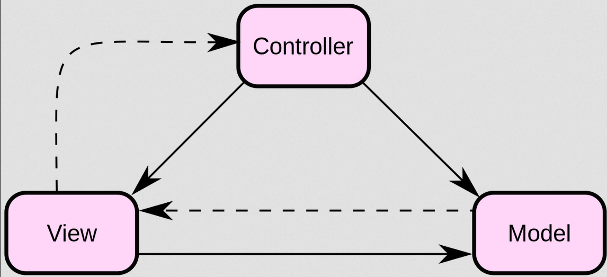

# Armazem | Fully Functional Social Network


> A totally `authorial project` developed around a month and a half, its objective is to connect manga readers in which users can authenticate
> on the platform send connection requests to each other, as well as post, like, share and discuss about certain subjects, they can also mark the
> manga they are reading, intend to read or that they have already completed, favorite and update. There are `private routes` only available to 
> `administrators who can insert new manga into the database`. There is chat and discussions with `two-way communication between client and server` 
> via `websockets`. All this being supported by a `RESTful API` on the backend, and with `dynamic rendering of React components` on the frontend.

:arrow_right: Model-View-Controller (MVC) | Architectural Pattern for Software Projects <br /> 
:arrow_right: API RESTful | Representational State Transfer <br /> 
:arrow_right: JSON Web Token (JWT) and Authentication <br /> 
:arrow_right: JSON (JavaScript Object Notation) <br /> 
:arrow_right: Nodemailer - Email submissions <br /> 
:arrow_right: useEffect | Handling Requests and Reacting to Data Changes with Side Effects <br /> 

<br />

## Model-View-Controller (MVC) | Architectural Pattern for Software Projects

MVC is a `software design pattern`, or `software architecture pattern` formulated in the 1970s, focused on code reuse and the `separation of concepts into three interconnected layers`, where `data presentation and interaction of users (front-end)` are separated from `methods that interact with the database (back-end)`. It is normally used for the development of `web applications that divide an application into parts (layers/components)`. This is done to `separate internal information representations` from the way `information is presented to the user`, leading to `efficient parallel development`.

<div align="center">

</div>

*<i>A simple diagram exemplifying the relationship between <strong>Model</strong>, <strong>View</strong> and <strong>Controller</strong>. Solid lines indicate direct association and dashed lines indicate indirect association.</i> <br />

Traditionally used for `graphical user interfaces` (GUIs), this architecture has become popular for designing `web applications` and even `mobile`, `desktop` and other client applications. Popular programming languages ​​like Java, C#, Object Pascal/Delphi, Ruby, PHP, JavaScript and others have popular MVC frameworks that are currently used in web application development.

### MODEL - Model or Application Logic Layer

Model is the `bridge between` the `View` and `Control` layers, it `consists of the logical part of the application`, which `manages the behavior of the data through business rules, logic and functions`. This is just waiting for the function call, `which allows access to data to be collected, recorded and displayed`.

It's the heart of execution, `responsible for everything the application will do from controlling layer commands on one or more data elements`, answering questions about their condition and instructions to change them. The model knows what the application wants to do and is `the main computational structure of the architecture, as it models the problem that is being solved`. Models the data and behavior behind the business process. It is only concerned with storing, manipulating and generating data. `It is a presentation-independent encapsulation of data and behavior`.

### VIEW - Visualization or Presentation Layer 

View can be any `data representation output`, such as a table or a diagram. `This is where requested data from the Model is displayed`. It is possible to have multiple views of the same data, such as a bar graph for management and a tabular view for counters. `The View also triggers interactions with the user, who interacts with the Controller`. The basic example of this is a button generated by a View, which a user clicks and triggers an action on the Control.

It is not dedicated to knowing how the knowledge was taken or where it was obtained, it 'just shows the reference'. According to Gamma et al (2006), `”The MVC approach separates View and Model through an insertion/notification protocol (subscribe/notify). A View must ensure that its expression reflects the state of the Model. Whenever the Model's data changes, the Model changes the Views that depend on it. In response, each View is given the opportunity to modify itself”`. Adds display elements to the user: HTML, ASP, XML, Applets. It is the user interface layer. It is `used to receive data input and visually present the result`.

### CONTROLLER - Controller or Control Layer

Control is the final component of the triad, `it mediates input and output`, `commanding the view and model to be changed appropriately as the user requests via mouse and keyboard`. The focus of the Control is the `user's action`, where the data that the user inserts or updates are manipulated, subsequently calling the Model.

The Controller sends these actions to the Model and to the visualization (View) window where the necessary operations will be carried out.

#### Component interaction

In addition to dividing the application into three types of components, the MVC design defines the interactions between them.

 - The `Controller` sends commands to the model to update its state (eg editing a document). The controller can also send commands to the associated view to change the presentation of the model view (for example, scrolling through a document).
 - A `Model` stores data and notifies its associated views and controllers when there is a change in its state. These notifications allow views to produce updated output and controllers to change the set of available commands. A passive MVC implementation mounts these notifications, either because the application doesn't need them or the software platform doesn't support them.
 - The `View` generates a representation (View) of the data present in the requested model, displaying the data, whether through html or xml.

#### Usage in web applications

Even though it was initially developed for personal computing, MVC has been drastically adapted as an architecture for web applications in all major programming languages. Many commercial and non-commercial application frameworks were developed based on this model. Such frameworks vary in their interpretations, mainly in the way that MVC responsibilities are separated between client and server.

The latest MVC web frameworks take a thin client approach that almost put the entire model, view, and controller logic on the server. In this approach, the client sends hyperlink requests or form input to the controller and then receives a complete and updated web page (or other document) from the view. The model exists entirely on the server. As client technologies matured, frameworks such as JavaScriptMVC and Backbone were created which allow MVC components to partially execute on the client (see also AJAX).

`A practical case is a web application where the view is an HTML (or derivative) document generated by the application. The controller receives a GET or POST input after a user stimulus and decides how to process it, invoking domain objects to handle the business logic, and finally invoking a view to present the output.`

*<i>en.wikipedia.org/wiki/Model%E2%80%93view%E2%80%93controller</i> <br />

### Example of MVC in this Application

 - <strong>Model Layer</strong>:
 
```js
// server/src/models/postModel.js

import mongoose, { Schema } from 'mongoose'

const postSchema = new mongoose.Schema(
  {
    by: { type: Schema.Types.ObjectId, ref: 'User' },
    title: {
      type: String,
    },
    body: {
      type: String,
    },
    likes: {
      type: Array,
      by: { type: Schema.Types.ObjectId, ref: 'User' },
    },
    discussions: {
      type: Array,
      discussion: { type: Schema.Types.ObjectId, ref: 'User' },
    },
  },
  { timestamps: true }
)

export default mongoose.model('Post', postSchema)

```

 - <strong>View Layer</strong>:
 
```jsx
// web/src/pages/post.jsx

export const Post = (props: Props) => {
  return (
    <GridWrapper>
      <main className={style.wrapperMain}>
        {loading || !post || !authorUser ? (
          rendersGettingData()
        ) : (
          <>
            <Article post={post} authorUser={authorUser} />
            <DiscussionInput discussions={discussions} socket={socket} />
            <div className={style.discussionsWrapper}>
              {discussions
                .slice(0)
                .reverse()
                .map((discussion: any, index: React.Key) => (
                  <section className={style.discussionContainer} key={index}>
                    <Discussions
                      socket={socket}
                      activeItem={activeItem}
                      setActiveItem={setActiveItem}
                      discussion={discussion}
                      currentUser={currentUser}
                    />
                  </section>
                ))}
            </div>
          </>
        )}
      </main>
    </GridWrapper>
  )
}
```

 - <strong>Controller Layer</strong>:
 
```js
// server/src/controllers/postController.js

export const postMetadataById = async (req, res) => {
  try {
    const postId = req.params.id
    const post = await Post.findById(postId)
    const userRef = await Post.findById(postId).select('by')
    const authorUser = await User.findById(userRef.by)
    const accountRef = await User.findById(userRef.by).select('account')
    const authorAccount = await Account.findById(accountRef.account)

    return res.status(200).json({
      status: true,
      msg: 'Post metadata successfully acquired',
      post,
      authorAccount,
      authorUser,
    })
  } catch (error) {
    console.error(error.message)
    return res.status(500).json({
      status: false,
      msg: error.message,
    })
  }
}
```

